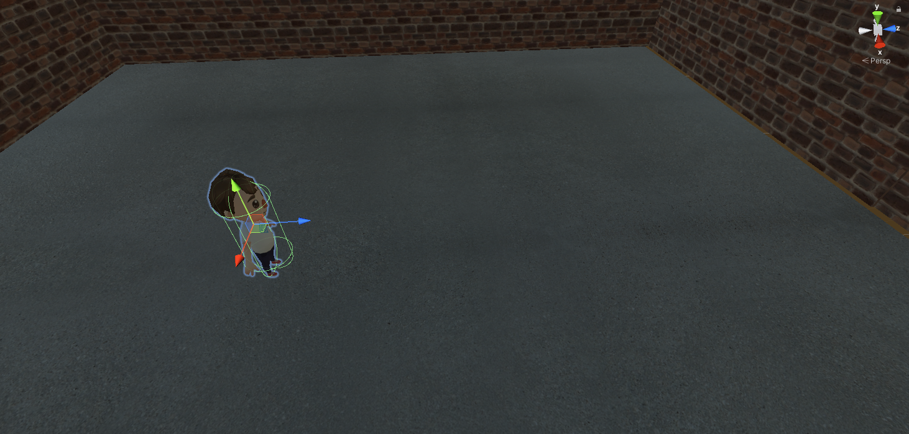

# 숨바꼭질

1. 게임소개
2. 캐릭터
3. 주차별 개발현황

---

## 게임소개

 - 게임명 : 숨바꼭질
 - 장르 : 퍼즐, 캐주얼
 - 개발엔진 : Unity3D
 - 게임설명 : ~

## 캐릭터

## 주차별 개발현황   

### 1주차 : 계획서 작성   

### 2주차 : 맵 제작과 주인공 캐릭터   
바닥과 벽을 세우고 주인공 캐릭터를 배치하였다.   
캐릭터 이동 스크립트와 콜라이더 등을 설정하였다.   
</img>
   
숨어있는 캐릭터를 찾았을 때의 상호작용 스크립트가 필요  

### 3주차 : 상호작용 스크립트 구현  
상호작용 스크립트를 구현하였다. 문을 클릭하면 여닫을 수 있다.   
</img>   
캐릭터를 클릭하면 "click"이라는 문자열이 출력된다.   
아직 에셋이 없어 3D오브젝트로 대체하였다.   

맵 제작 및 캐릭터 에셋 필요     

### 4주차 : 맵 제작   
맵 제작이 거의 완료되었다.   
</img>
캐릭터 에셋이 추가되었다.   
</img>
   
맵 제작 마무리(라이트 추가, 문이나 선반 등의 오브젝트에 스크립트 설정 필요)   
캐릭터 이동 스크립트 수정 필요   

### 5주차 : 스크립트 수정   
맵 제작 마무리
</img>
WASD로 이동하고 카메라가 마우스 커서를 따라 회전하도록 수정   

오브젝트와 상호작용할 때 거리와 관계없이 상호작용 됨   
마우스커서->크로스헤어 변경 필요   

### 6주차 : 스크립트 수정   
일정 거리 내에서만 오브젝트와 상호작용할 수 있도록 수정   
마우스 커서->크로스헤어로 변경
</img>
   
좌우(AD)이동시 애니메이션이 움직이지 않음   
웅크리는 애니메이션 필요   
일부 오브젝트 수정 필요   

### 7주차 : 중간평가

