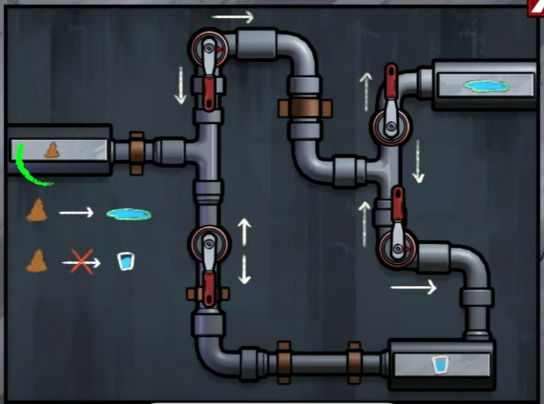
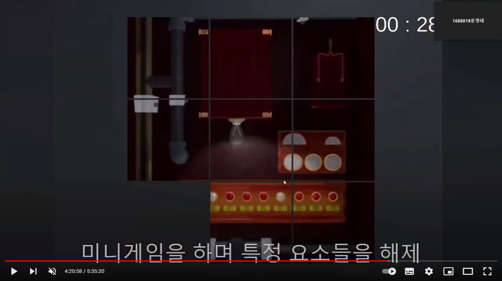
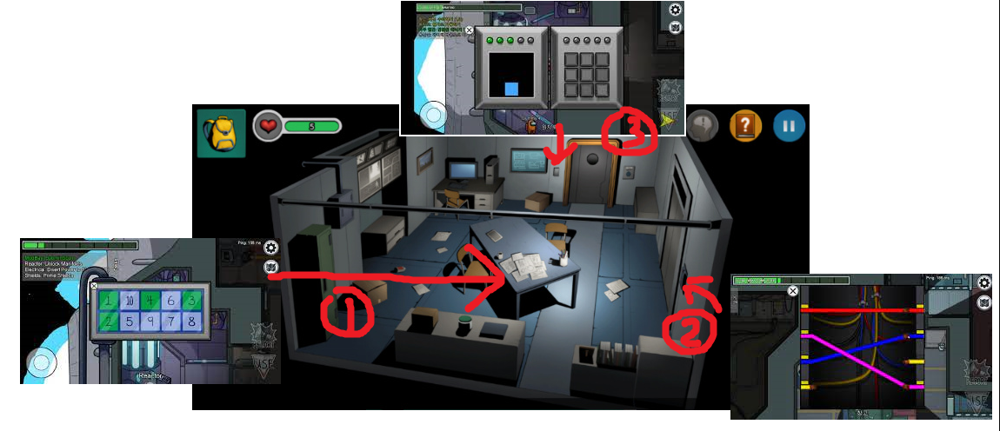
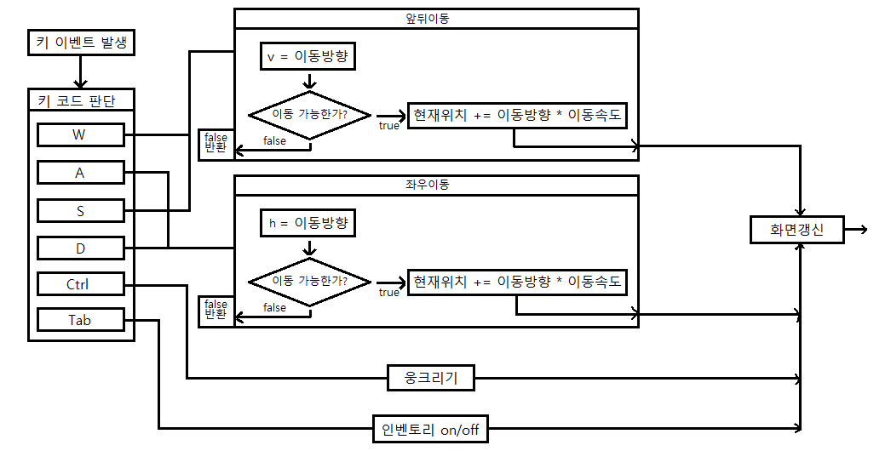

# 프로젝트명: Door(육기정)

# 목차
### [1. 컨셉](#컨셉)
### [2. 관련이미지 and 동영상](#관련-이미지-and-동영상)
### [3. 대표 이미지](#대표-이미지)
### [4. 컨셉 and 대표이미지 기반 작품묘사](#컨셉-and-대표이미지-기반-작품묘사)
### [5. Door 구성 요소](#door-구성-요소)
### [6. 게임 시스템 디자인](#게임-시스템-디자인)
### [7. 개발 요구사항 and 흐름도](#개발-요구사항-and-흐름도)

  

# [컨셉] 

## 메인컨셉 : 힌트

- 방탈출 게임은 기본적으로 아이템을 탐색하고 그 아이템으로 방을 탈출해야 하는데, 아이템을 찾으려면 방을 일일이 뒤져야 해서 시간도 오래 걸리고 짜증이 나기 때문에 주어진 퍼즐을 해결하면 다음 퍼즐로 이어지는 힌트를 주어 게임 플레이가 막히는 일이 없도록 할 것입니다.

### 서브 컨셉 1 : 수수께끼 

- 게임 안에 미니게임으로 다양한 퍼즐을 넣을 것입니다.

### 서브 컨셉 2 : 제한시간

- 게임 특성상 미니게임으로 넣을 퍼즐은 플레이어가 처음 봐도 어떻게 풀어야 하는지 알수 있게 간단해야 하기 때문에 좀더 재미를 주기 위해 퍼즐을 풀 때에 제한시간을 줄 것입니다.

### 서브 컨셉 3 : 타임어택 

- 클리어 시간을 표시하여 플레이어가 더 빠른 시간안에 클리어를 목표로 도전욕구를 가지게 됩니다.

### 서브 컨셉 4 : 긴장감 

- 게임에 몰입할 수 있게 적당히 긴장감 있는 분위기

### 서브 컨셉 5 : 추리 

- 방의 어디에 퍼즐이 있는지 플레이어가 추리할 수 있게 만들 것입니다.

  

# [관련 이미지 and 동영상]

- 이미지  
  
- 동영상 (4:20:00부분)
  

  

# [대표 이미지]

  

# [컨셉 and 대표이미지 기반 작품묘사]

> ### 대표이미지 기반 : 

UI : 맵을 나아가기 위한 아이템창이 있고 끄고 켤수 있게 만들 생각입니다.

맵 : 이미지는 실제 맵과는 다르겠지만 실내에서 몇 개의 방을 나아가며 진행되는데 방 개수와 퍼즐의 개수는 정해지지 않았습니다. 

퍼즐 : 이미지를 보면 맵 내에 배치된 퍼즐과 풀이순서가 표시되어 있는데 실제 게임 내에서 풀이순서는 따로 표시하지 않을 생각이다. 게임이 시작되면 플레이어에게 퍼즐 하나를 주고, 퍼즐을 풀면 다음 퍼즐로 가는 힌트나 메시지를 주어 막힘없이 진행할 수 있도록 플레이어를 유도할수 있게 만들 생각입니다.

> ### 컨셉 기반: 

게임이 시작되면 플레이어에게 퍼즐 하나가 주어집니다. 퍼즐을 풀면 다음 퍼즐로 이어지는 단서를 획득하게 되고 플레이어는 그 단서를 기반으로 다음 퍼즐을 위치를 추리하고 퍼즐을 풀면서 방을 탈출하게 됩니다.

  

# [Door 구성 요소]

- 여러가지 퍼즐을 풀며 나아가는 방탈출

 

## 1. 메커니즘

[도전 과제]

1. 제한시간 안에 퍼즐을 푼다. 
2. 더 빠른 시간 안에 클리어한다.

[재미 요소]

1. 다양한 퍼즐 : 다양한 퍼즐을 넣어야 하기 때문에 풀기 쉽고 한눈에 알아볼 수 있는 퍼즐로 해야한다. 하지만 그렇게 하면 게임이 단순하고 지루해 질 수 있기 때문에 퍼즐을 푸는데에 제한시간을 두었습니다.
2. 타임어택 : 게임을 클리어하면 클리어 시간이 표시되어 플레이어가 더 빠른 시간 안에 클리어를 노리도록 하였습니다.
3. 힌트 : 퍼즐을 풀면 다음 퍼즐의 위치를 알려주는 힌트가 주어집니다. 이 단서를 활용하여 다음 퍼즐의 위치를 추리하고 다시 퍼즐을 푸는 형식으로 진행됩니다.

 

## 2. 이야기

[만들게 된 배경]  
방탈출 게임은 플레이어의 창의성을 요구하는 게임이기 때문에 제작자의 의도를 이해하지 못하면 특정 구간에서 막혀 몇 시간동안 맵을 헤메는 일이 있어 짜증이 났습니다. 그런 부분을 해결하기 위해 이러한 게임을 만들게 되었습니다. 기존의 방탈출 게임은 탈출에 필요한 아이템을 탐색하고 사용하는 데에 플레이어의 창의성을 요구하여 다소 비합리적인 면이 있지만, 이 게임은 처음에 주어지는 퍼즐을 풀면 다음 퍼즐로 이어지는 힌트를 줌으로서 게임 진행이 막히는 일이 없도록 할 것입니다.

[카메라 관점]  
1인칭 시점으로 진행됩니다. 3인칭 시점을 하면 플레이어가 주변 상황을 한눈에 알수 있기 때문에 탐색게임에 적합하지 않다고 생각했습니다.

 

## 3. 미적요소

[디자인][컬러]  
침실, 부엌, 거실, 욕실 등 여러가지 방이 배경입니다. 퍼즐을 풀 때는 상단에 남은 시간을 표시해주는 UI가 나타나고 보유하고 있는 아이템을 확인할 수 있는 아이템창을 끄고 켤수 있게 만들 생각입니다. 실내가 배경이기 때문에 그다지 밝지 않고 너무 어둡지도 않은 색조로 할 계획입니다.

[음향]  
처음 게임을 시작할 때는 배경음이 없습니다. 발소리나 옷깃 스치는 소리 같은 효과음만 들리게 하여 정적을 강조할 생각입니다. 그리고 퍼즐을 풀다가 시간이 짧아지면 배경음이 켜지며 긴장감을 조성하게 됩니다.

 

## 4. 기술

Unity3D 엔진을 사용하여 PC용 게임으로 개발할 계획입니다.

  

# [게임 시스템 디자인]

 

## 1. 게임 오브젝트 분해

|연번|오브젝트 이름(영문이름)|오브젝트 이미지|
|:---:|:---:|:---:|
|1|플레이어(Player)||
|2|폭탄(bomb)||
|3|열쇠(key)||
|4|쪽지(hint)||
|5|인벤토리(inventory)||
|6|문(door)||
|7|가구(funiture)||
|8|방(Room)||

  

## 2. 파라미터(속성)

### 1) 폭탄

|속성|영문명칭|설명|
|:---:|:---:|:---:|
|제한시간|time|플레이어가 상호작용한 뒤부터 카운트 시작|
|작동|start|플레이어가 상호작용하면 활성화|

 

### 2) 문, 가구

|속성|영문명칭|설명|
|:---:|:---:|:---:|
|잠김|lock|플레이어가 해당하는  획득하지 못한 상태이면 열리지 않음|

  

## 3. 행동

### 1)  폭탄

|행동|영문명칭|설명|
|:---:|:---:|:---:|
|게임오버|gameover|제한시간 내에 폭탄을 해제하지 못하면 게임오버됨|
|폭탄해제|clear|플레이어에게 열쇠와 쪽지를 줌|

 

### 2) 문, 가구

|행동|영문명칭|설명|
|:---:|:---:|:---:|
|열림|open|잠금해제된 상태에서 상호작용하면 열림|
|닫힘|close|열려있는 상태에서 상호작용하면 닫힘|

  

## 4. 상태

### 1) 폭탄

|현재상태|전이상태|전이조건|
|:---:|:---:|:---:|
|대기|시작|플레이어와 상호작용|
|시작|터짐|폭탄을 해제하기 전에 제한시간이 끝남|
|시작|해제|제한시간이 끝나기 전에 폭탄이 해제됨|

 

### 2) 문, 가구

|현재상태|전이상태|전이조건|
|:---:|:---:|:---:|
|잠김|열림|해당하는 아이템을 획득한 상태에서 상호작용|

  

## 5. 플레이어 캐릭터 속성(파라미터)

|속성|영문명칭|설명|
|:---:|:---:|:---:|
|이동속도|speed|플레이어 이동속도|
|웅크리기|ctrl|플레이어가 웅크리고 있는|
|열쇠|has_key|플레이어가 획득한 열쇠|
|힌트|has_hint|플레이어가 획득한 힌트|

  

## 6. 게임의 규칙

### 1) 핵심 규칙
1. 플레이어는 폭탄을 해체한다. 
2. 폭탄을 해체해서 얻은 아이템으로 다음 폭탄을 찾는다. 
3. 모든 폭탄을 해체하면 다음 방으로 갈수 있다. 
4. 모든 방을 클리어하면 클리어시간이 표시된다.

### 2) 보조 규칙
클리어시간에 따라 순위가 기록되어 더 짧은 시간안에 클리어를 목표로 한다.

  

## 7. 게임에서 사용될 공식

제한시간 감소 : 제한시간 -= 감소속도 * Time.deltaTim

  

# [개발 요구사항 and 흐름도]

 

## 1. 요구사항

 - 게임화면, 설정화면, 결과화면이 있다.
 - 게임화면 좌측에는 키 설명 UI가 표시된다.
 - 탭을 누르면 인벤토리가 켜지고 캐릭터를 움직일 수 없게 된다.
 - 인벤토리 내에서는 자신이 얻은 열쇠와 힌트를 확인할 수 있다.
 - 폭탄과 상호작용 하면 폭탄을 해제하는 미니게임이 시작되고 화면 상단에 제한시간이 표시된다.
 - 설정화면엔 게임종료 버튼, 하이스코어 확인 버튼, 시계 온오프 버튼이 있다.
 - 게임종료 버튼을 누르면 게임이 종료된다.
 - 하이스코어 확인 버튼을 누르면 하이스코어 기록을 확인할 수 있다.
 - 시계 온오프 버튼을 누르면 게임화면에 시간이 표시된다.
 - 게임을 클리어하면 결과화면이 표시된다.
 - 결과화면에는 클리어 시간과 하이스코어 차트가 표시되고 다시 시작 버튼이 표시된다.
 - 다시 시작 버튼을 누르면 게임이 처음부터 다시 시작된다.
 - 조작은 Tab, ctrl, WASD, 마우스로 조작한다.
 - 게임 종료 조건은 제한시간 내에 폭탄을 해제하지 못하는 것이다.
 - 게임 클리어 조건은 모든 방을 탈출하는 것이다.

  

## 2. 시간별 흐름도 flowchart

  

## 3. 키보드 이벤트에 대한 흐름도

  

## 4. 용어정리

  

## 5. 스토리보드

||||
|:---:|:---:|:---:|
|1. 주인공이 눈을 뜨고 자신이 감금되어 있다는 사실을 깨닫는다.|2. 주변을 둘러보다 폭탄을 발견하게 된다.|3. 폭탄을 해체하고 탈출할 수 있는 단서를 얻은 주인공은 계속해서 폭탄을 해체하며 방을 나아간다.|

  

