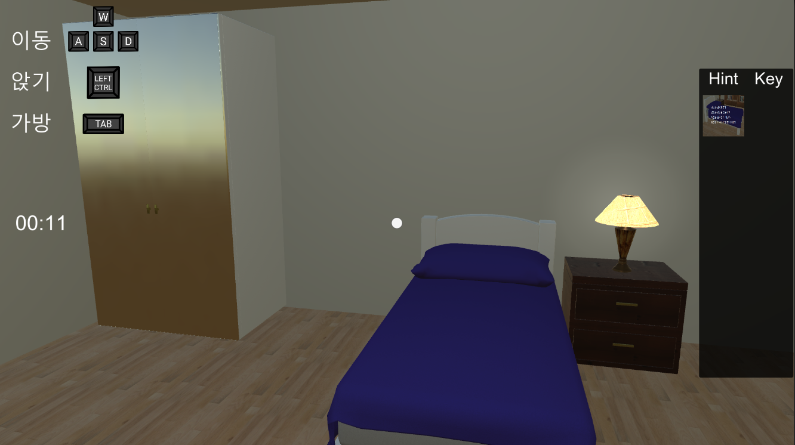
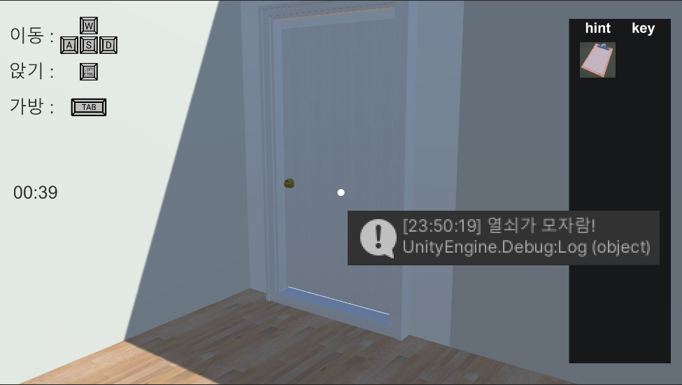
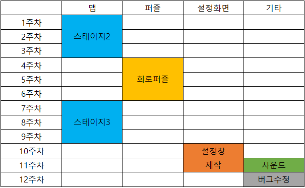
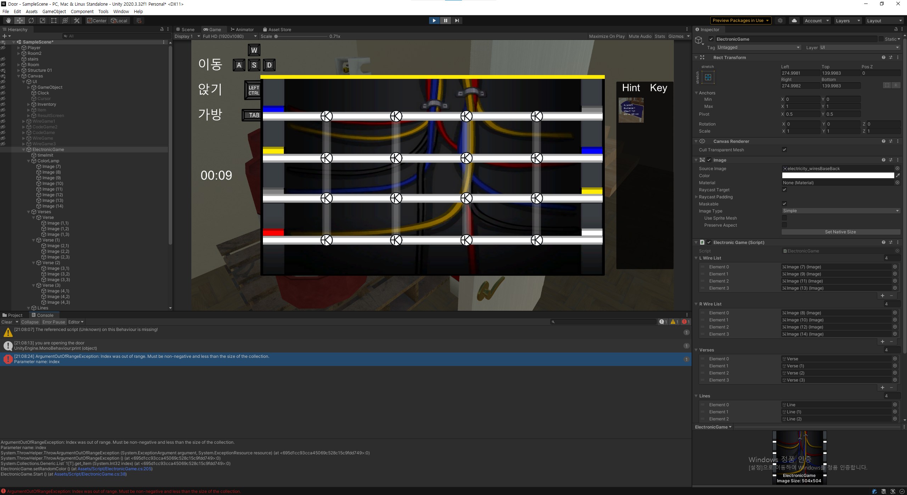
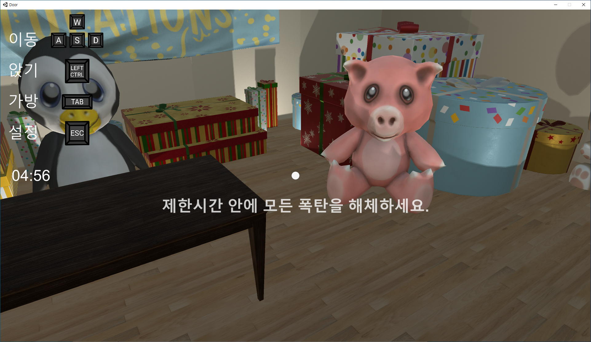

# 프로젝트명: Door(육기정)

# 목차
### [1. 컨셉](#컨셉)
### [2. 관련이미지 and 동영상](#관련-이미지-and-동영상)
### [3. 대표 이미지](#대표-이미지)
### [4. 컨셉 and 대표이미지 기반 작품묘사](#컨셉-and-대표이미지-기반-작품묘사)
### [5. Door 구성 요소](#door-구성-요소)
### [6. 게임 시스템 디자인](#게임-시스템-디자인)
### [7. 개발 요구사항 and 흐름도](#개발-요구사항-and-흐름도)
### [8. 스토리보드](#스토리보드)
### [9. 프로토타입 개발 요구사항 (6주개발)](#프로토타입-개발-요구사항)
### [10. 프로토타입 개발작업 일정 (6주개발)](#프로토타입-개발작업-일정)
### [11. 프로토타입 작업현황](#프로토타입-작업현황)
### [12. 개발작업 일정](#개발작업-일정)
### [13. 주차별 작업현황](#주차별-작업현황)
### [14. 기능추가](#기능추가)

  

# [컨셉] 

## 메인컨셉 : 힌트

- 방탈출 게임은 기본적으로 아이템을 탐색하고 그 아이템으로 방을 탈출해야 하는데, 아이템을 찾으려면 방을 일일이 뒤져야 해서 시간도 오래 걸리고 짜증이 나기 때문에 주어진 퍼즐을 해결하면 다음 퍼즐로 이어지는 힌트를 주어 게임 플레이가 막히는 일이 없도록 만들 예정이다.

### 서브 컨셉 1 : 퍼즐 

- 게임 안에 미니게임으로 다양한 퍼즐을 넣을 예정이다.

### 서브 컨셉 2 : 제한시간

- 게임 특성상 미니게임으로 넣을 퍼즐은 플레이어가 처음 봐도 어떻게 풀어야 하는지 알수 있게 간단해야 하기 때문에 좀더 재미를 주기 위해 퍼즐에 제한시간을 줄 것이다.

### 서브 컨셉 3 : 타임어택 

- 클리어 시간을 표시하여 플레이어가 더 빠른 시간안에 클리어를 목표로 도전욕구를 가지게 됩니다.

### 서브 컨셉 4 : 긴장감 

- 폭탄이 언제 터질지 모르는 긴장감

### 서브 컨셉 5 : 추리 

- 방의 어디에 퍼즐이 있는지 플레이어가 추리할 수 있게 만든다.

  

# [관련 이미지 and 동영상]

- 이미지  
  
- 동영상 (4:20:00부분)
  

  

# [대표 이미지]

  

# [컨셉 and 대표이미지 기반 작품묘사]

> ### 대표이미지 기반 : 

퍼즐 : 클리어하면 폭탄을 해체할 수 있고 다음 폭탄의 위치를 알수 있는 힌트와 방을 탈출하는데 필요한 열쇠를 획득할 수 있습니다.

> ### 컨셉 기반: 

게임이 시작되면 플레이어에게 퍼즐 하나가 주어집니다. 퍼즐을 풀면 다음 퍼즐로 이어지는 단서를 획득하게 되고 플레이어는 그 단서를 기반으로 다음 퍼즐을 위치를 추리하고 퍼즐을 풀면서 방을 탈출하게 됩니다.

  

# [Door 구성 요소]

- 여러가지 퍼즐을 풀며 나아가는 방탈출

 

## 1. 메커니즘

[도전 과제]

1. 제한시간 안에 퍼즐을 푼다. 
2. 더 빠른 시간 안에 클리어한다.

[재미 요소]

1. 다양한 퍼즐 : 다양한 퍼즐을 넣어야 하기 때문에 풀기 쉽고 한눈에 알아볼 수 있는 퍼즐로 해야한다. 하지만 그렇게 하면 게임이 단순하고 지루해 질 수 있기 때문에 퍼즐을 푸는데에 제한시간을 두었습니다.
2. 타임어택 : 게임을 클리어하면 클리어 시간이 표시되어 플레이어가 더 빠른 시간 안에 클리어를 노리도록 하였습니다.
3. 힌트 : 퍼즐을 풀면 다음 퍼즐의 위치를 알려주는 힌트가 주어집니다. 이 단서를 활용하여 다음 퍼즐의 위치를 추리하고 다시 퍼즐을 푸는 형식으로 진행됩니다.

 

## 2. 이야기

[만들게 된 배경]  
방탈출 게임은 플레이어의 창의성을 요구하는 게임이기 때문에 제작자의 의도를 이해하지 못하면 특정 구간에서 막혀 몇 시간동안 맵을 헤메는 일이 있어 짜증이 났습니다. 그런 부분을 해결하기 위해 이러한 게임을 만들게 되었습니다. 기존의 방탈출 게임은 탈출에 필요한 아이템을 탐색하고 사용하는 데에 플레이어의 창의성을 요구하여 다소 비합리적인 면이 있지만, 이 게임은 처음에 주어지는 퍼즐을 풀면 다음 퍼즐로 이어지는 힌트를 줌으로서 게임 진행이 막히는 일이 없도록 할 것입니다.

[카메라 관점]  
1인칭 시점으로 진행됩니다. 3인칭 시점을 하면 플레이어가 주변 상황을 한눈에 알수 있기 때문에 탐색게임에 적합하지 않다고 생각했습니다.

 

## 3. 미적요소

[디자인][컬러]  
침실, 부엌, 거실, 욕실 등 여러가지 방이 배경입니다. 퍼즐을 풀 때는 상단에 남은 시간을 표시해주는 UI가 나타나고 보유하고 있는 아이템을 확인할 수 있는 아이템창을 끄고 켤수 있게 만들 생각입니다. 실내가 배경이기 때문에 그다지 밝지 않고 너무 어둡지도 않은 색조로 할 계획입니다.

[음향]  
처음 게임을 시작할 때는 배경음이 없습니다. 발소리나 옷깃 스치는 소리 같은 효과음만 들리게 하여 정적을 강조할 생각입니다. 그리고 퍼즐을 풀다가 시간이 짧아지면 배경음이 켜지며 긴장감을 조성하게 됩니다.

 

## 4. 기술

Unity3D 엔진을 사용하여 PC용 게임으로 개발할 계획입니다.

  

# [게임 시스템 디자인]

 

## 1. 게임 오브젝트 분해

|연번|오브젝트 이름(영문이름)|오브젝트 이미지|
|:---:|:---:|:---:|
|1|플레이어(Player)||
|2|폭탄(bomb)||
|3|열쇠(key)||
|4|단서(hint)||
|5|인벤토리(inventory)||
|6|문(door)||
|7|가구(funiture)||
|8|방(Room)||

  

## 2. 파라미터(속성)

### 1) 폭탄

|속성|영문명칭|설명|
|:---:|:---:|:---:|
|제한시간|time|플레이어가 상호작용한 뒤부터 카운트 시작|
|작동|start|플레이어가 상호작용하면 활성화|

 

### 2) 문, 가구

|속성|영문명칭|설명|
|:---:|:---:|:---:|
|잠김|lock|플레이어가 열쇠 혹은  획득하지 못한 상태이면 열리지 않음|

  

## 3. 행동

### 1)  폭탄

|행동|영문명칭|설명|
|:---:|:---:|:---:|
|게임오버|gameover|제한시간 내에 폭탄을 해제하지 못하면 게임오버됨|
|폭탄해제|clear|플레이어에게 열쇠와 단서를 줌|

 

### 2) 문, 가구

|행동|영문명칭|설명|
|:---:|:---:|:---:|
|열림|open|잠금해제된 상태에서 상호작용하면 열림|
|닫힘|close|열려있는 상태에서 상호작용하면 닫힘|

  

## 4. 상태

### 1) 폭탄

|현재상태|전이상태|전이조건|
|:---:|:---:|:---:|
|대기|시작|플레이어와 상호작용|
|시작|터짐|폭탄을 해제하기 전에 제한시간이 끝남|
|시작|해제|제한시간이 끝나기 전에 폭탄이 해제됨|

 

### 2) 문, 가구

|현재상태|전이상태|전이조건|
|:---:|:---:|:---:|
|잠김|열림|해당하는 아이템을 획득한 상태에서 상호작용|

  

## 5. 플레이어 캐릭터 속성(파라미터)

|속성|영문명칭|설명|
|:---:|:---:|:---:|
|이동속도|speed|플레이어 이동속도|
|웅크리기|ctrl|플레이어가 웅크리고 있는|
|열쇠소지|has_key|플레이어가 획득한 열쇠|
|단서소지|has_hint|플레이어가 획득한 힌트|

  

## 6. 게임규칙

### 1) 핵심 규칙
1. 플레이어는 폭탄을 해체한다. 
2. 폭탄을 해체해서 얻은 아이템으로 다음 폭탄을 찾는다. 
3. 모든 폭탄을 해체하면 다음 방으로 갈수 있다. 
4. 모든 방을 클리어하면 클리어시간이 표시된다.

### 2) 보조 규칙
클리어시간에 따라 순위가 기록되어 더 짧은 시간안에 클리어를 목표로 한다.

  

## 7. 게임에서 사용될 공식

제한시간 감소 : 제한시간 -= 감소속도 * Time.deltaTime

  

# [개발 요구사항 and 흐름도]

 

## 1. 요구사항

### 게임화면
 - 게임화면 좌측에는 키 설명 UI가 표시된다.
 - 게임화면 우측에는 시간이 표시된다.
 - Tab을 누르면 인벤토리가 켜지고 캐릭터를 움직일 수 없게 된다.
 - 인벤토리 내에서는 자신이 얻은 열쇠와 단서를 확인할 수 있다.
 - 폭탄과 상호작용 하면 폭탄을 해제하는 미니게임이 시작되고 화면 상단에 제한시간이 표시된다.
 - 미니게임을 클리어하면 열쇠와 단서를 획득한다.
 - 조작은 ctrl, WASD, 마우스로 조작한다.
 - 게임 클리어 조건은 모든 방을 탈출하는 것이다.
 - 게임 종료 조건은 제한시간 내에 폭탄을 해제하지 못하는 것이다.
 - WASD로 이동하며 이동속도는 고정이다.
 - ctrl을 누르면 웅크릴 수 있고 웅크린 상태로 이동은 불가능하다.
 - 1인칭 시점으로 진행되며 마우스로 캐릭터가 바라보는 방향을 바꿀 수 있다.
 - 미니게임은 코드입력 게임, 전선절단 게임, 회로 게임 3종류가 있다.
 - 코드 입력 게임은 1~9의 숫자를 순서대로 입력하면 클리어할 수 있다.
 - 전선절단 게임은 4개의 전선을 정해진 순서대로 절단하면 클리어할 수 있다.
 - 회로 게임은 전기신호를 특정 방향으로 유도하면 클리어할 수 있다.
 - 전선절단 게임이 시작되면 4개의 전선에 랜덤하게 색이 배정된다.
 - 플레이어가 전선을 클릭하면 잘린 전선 스프라이트로 바뀐다.
 - 코드입력 게임이 시작되면 1~9까지의  3x3 크기의 공간 안에 랜덤하게 배치된다.
 - 폭탄은 가구 오브젝트에 숨겨져 있고 해당하는 단서 아이템을 소지하지 않으면 상호작용 할 수 없다.
 - 문은 방안의 열쇠를 모두 획득하지 않으면 열리지 않는다.
 - 제한시간이 많이 줄어들면 빨강색으로 변하며 소리가 빨라진다.
 - 문 오브젝트에 필요한 열쇠 색깔이 표시된다.
 - 맵 중간중간 함정으로 고난이도의 폭탄을 배치한다.
 - 함정 폭탄은 클리어는 가능하지만 아이템을 주지 않아 게임 클리어에는 영향을 끼치지 않는다.

### 설정화면
 - 설정화면엔 게임종료 버튼, 하이스코어 확인 버튼, 시계 온오프 버튼이 있다.
 - 게임종료 버튼을 누르면 게임이 종료된다.
 - 하이스코어 확인 버튼을 누르면 하이스코어 기록을 확인할 수 있다.
 - 시계 온오프 버튼을 누르면 게임화면에 시간이 표시된다.
 - 전체화면 모드를 설정할 수 있다.
 - 화면 해상도를 선택할 수 있다.
 - 소리크기를 조절할 수 있다.
 - 마우스 감도를 조절할 수 있다.

### 결과화면
 - 결과화면에는 클리어 시간과 하이스코어 차트가 표시되고 다시 시작 버튼이 표시된다.
 - 클리어 시간이 순위 안에 들어가면 이름을 입력하고 랭킹에 반영된다.
 - 다시 시작 버튼을 누르면 게임이 처음부터 다시 시작된다.

  

## 2. 키보드 이벤트에 대한 흐름도

  

# [스토리보드]

||||
|:---:|:---:|:---:|
|1. 주인공이 눈을 뜨고 자신이 감금되어 있다는 사실을 깨닫는다.|2. 주변을 둘러보다 폭탄을 발견하게 된다.|3. 폭탄을 해체하고 탈출할 수 있는 단서를 얻은 주인공은 폭탄을 해체하며 방을 나아간다.|

  

# [프로토타입 개발 요구사항]

 

1주차 요구사항 : 이동 스크립트 작성
 - ~~조작은 Tab, ctrl, WASD, 마우스로 조작한다.~~
 - ~~WASD로 이동하며 이동속도는 고정이다.~~
 - ~~1인칭 시점으로 진행되며 마우스로 캐릭터가 바라보는 방향을 바꿀 수 있다.~~

2주차 요구사항 : UI 및 이동 스크립트 완성(웅크리기 기능)
 - ~~게임화면 좌측에는 키 설명 UI가 표시된다.~~
 - ~~ctrl을 누르면 웅크릴 수 있고 웅크린 상태로 이동은 불가능하다.~~
 - ~~게임화면 우측에는 시간이 표시된다.~~

3주차 요구사항 : 미니게임 제작
 - ~~폭탄과 상호작용 하면 폭탄을 해제하는 미니게임이 시작되고 화면 상단에 제한시간이 표시된다.~~
 - 미니게임은 코드입력 게임, 전선절단 게임, 회로 게임 3종류가 있다.
 - ~~인벤토리 내에서는 자신이 얻은 열쇠와 단서를 확인할 수 있다.~~
 - ~~게임 종료 조건은 제한시간 내에 폭탄을 해제하지 못하는 것이다.~~
 - ~~미니게임을 클리어하면 열쇠와 단서를 획득한다.~~

4주차 요구사항 : 미니게임 제작
 - 미니게임은 코드입력 게임, 전선절단 게임, 회로 게임 3종류가 있다.
 - ~~전선절단 게임이 시작되면 4개의 전선에 랜덤하게 색이 배정된다.~~
 - ~~플레이어가 전선을 클릭하면 잘린 전선 스프라이트로 바뀐다.~~
 - ~~전선절단 게임은 4개의 전선을 정해진 순서대로 절단하면 클리어할 수 있다.~~
 - ~~코드입력 게임이 시작되면 1~9까지의  3x3 크기의 공간 안에 랜덤하게 배치된다.~~
 - ~~코드 입력 게임은 1~9의 숫자를 순서대로 입력하면 클리어할 수 있다.~~

5주차 요구사항 : 맵 제작 및 사운드
 - ~~폭탄은 가구 오브젝트에 숨겨져 있고 해당하는 단서 아이템을 소지하지 않으면 상호작용 할 수 없다.~~
 - ~~문은 방안의 열쇠를 모두 획득하지 않으면 열리지 않는다.~~
 - ~~제한시간이 많이 줄어들면 빨강색으로 변하며 소리가 빨라진다.~~

6주차 요구사항 : 랭킹 시스템 
 - 게임화면, 설정화면, 결과화면이 있다.
 - ~~결과화면에는 클리어 시간과 하이스코어 차트가 표시되고 다시 시작 버튼이 표시된다.~~
 - ~~다시 시작 버튼을 누르면 게임이 처음부터 다시 시작된다.~~
 - ~~문 오브젝트에 필요한 열쇠 색깔이 표시된다.~~
 - ~~맵 중간중간 함정으로 고난이도의 폭탄을 배치한다.~~
 - ~~함정 폭탄은 클리어는 가능하지만 아이템을 주지 않아 게임 클리어에는 영향을 끼치지 않는다.~~

  

# [프로토타입 개발작업 일정]

 

 

  

# [프로토타입 작업현황]

 

1주차 : 이동 스크립트 작성
 - 조작은 Tab, ctrl, WASD, 마우스로 조작한다.(50%)
 - WASD로 이동하며 이동속도는 고정이다.(100%)
 - 1인칭 시점으로 진행되며 마우스로 캐릭터가 바라보는 방향을 바꿀 수 있다.(100%)

 

 

2주차 : UI 및 이동 스크립트 완성(웅크리기 기능)
 - 조작은 Tab, ctrl, WASD, 마우스로 조작한다.(100%)
 - 게임화면 좌측에는 키 설명 UI가 표시된다.(100%)
 - ctrl을 누르면 웅크릴 수 있고 웅크린 상태로 이동은 불가능하다.(100%)
 - 탭을 누르면 인벤토리가 켜지고 캐릭터를 움직일 수 없게 된다.(100%)
 - 게임화면 우측에는 시간이 표시된다.(100%)

 

3주차 요구사항 : 미니게임 제작
 - 폭탄과 상호작용 하면 폭탄을 해제하는 미니게임이 시작되고 화면 상단에 제한시간이 표시된다.(100%)
 - 미니게임은 코드입력 게임, 전선절단 게임, 회로 게임 3종류가 있다.(25%)
 - 인벤토리 내에서는 자신이 얻은 열쇠와 단서를 확인할 수 있다.(100%)
 - 게임 종료 조건은 제한시간 내에 폭탄을 해제하지 못하는 것이다.(100%)
 - 미니게임을 클리어하면 열쇠와 단서를 획득한다.(100%)

||||
|:---:|:---:|:---:|
||||

 - 전선절단 게임이 시작되면 4개의 전선에 랜덤하게 색이 배정된다.(80%)

 

4주차 요구사항 : 미니게임 제작(전선절단 게임)
 - 미니게임은 코드입력 게임, 전선절단 게임, 회로 게임 3종류가 있다.(50%)
 - 전선절단 게임이 시작되면 4개의 전선에 랜덤하게 색이 배정된다.(100%)
 - 플레이어가 전선을 클릭하면 잘린 전선 스프라이트로 바뀐다.(100%)
 - 전선절단 게임은 4개의 전선을 정해진 순서대로 절단하면 클리어할 수 있다.(100%)

|||
|:---:|:---:|
|||

 - 미니게임은 코드입력 게임, 전선절단 게임, 회로 게임 3종류가 있다.(75%)
 - 코드입력 게임이 시작되면 1~9까지의  3x3 크기의 공간 안에 랜덤하게 배치된다.(100%)
 - 코드 입력 게임은 1~9의 숫자를 순서대로 입력하면 클리어할 수 있다.(100%)

|||
|:---:|:---:|
|||

 

5주차 요구사항 : 맵 제작 및 사운드
 - 폭탄은 가구 오브젝트에 숨겨져 있고 해당하는 단서 아이템을 소지하지 않으면 상호작용 할 수 없다.(100%)
 - 문은 방안의 열쇠를 모두 획득하지 않으면 열리지 않는다.(100%)
 - 제한시간이 많이 줄어들면 빨강색으로 변하며 소리가 빨라진다.(50%)

|||
|:---:|:---:|
|||

 

6주차 요구사항 : 랭킹 시스템 
 - 게임화면, 설정화면, 결과화면이 있다.(75%)
 - 결과화면에는 클리어 시간과 하이스코어 차트가 표시되고 다시 시작 버튼이 표시된다.(100%)
 - 다시 시작 버튼을 누르면 게임이 처음부터 다시 시작된다.(100%)
 - 문 오브젝트에 필요한 열쇠 색깔이 표시된다.(100%)
 - 맵 중간중간 함정으로 고난이도의 폭탄을 배치한다.(50%)
 - 함정 폭탄은 클리어는 가능하지만 아이템을 주지 않아 게임 클리어에는 영향을 끼치지 않는다.(100%)

 - 제한시간이 많이 줄어들면 빨강색으로 변하며 소리가 빨라진다.(100%)

||||
|:---:|:---:|:---:|
||||

 

  

# [개발작업 일정]

 

 

  

# [주차별 작업현황]

 

1주차 : 맵 1층 제작

 - 1, 2층 연결하는 계단과 벽 세우는 작업 

 

2주차 : 2번째 맵 제작

 - 폭탄을 제조하는 방이라는 컨셉으로 제작 
 - 곳곳에 폭탄(퍼즐) 배치 

 

3주차 : 회로게임 제작

 - 양쪽에 랜덤하게 색깔을 배치하는 기능 구현 
 - 회로 연결하는 기능 구현 

 

4주차 : 회로게임 제작

 - 연결된 회로 표시 기능 구현 
 - 승리 및 패배 코드 구현 

 

5주차 : 3번째 맵 제작 및 버그수정

 - 맵 작업 마무리, 거실 부엌 욕실 등 기타 작업 
 - 같은 색깔이 중복되어 나오는 버그 수정 
 - 승리조건이 충족되도 승리가 되지 않는 버그 수정
 - 아직 연결할 수 있는 회로가 남아있는데 패배하는 버그 수정 
 - 회로가 한 번 연결되었다가 끊어졌을 경우 원래 색깔로 돌아오지 않는 버그 수정 

 

6주차 : 라이트 배치 및 사운드 추가

 - 라이트 배치 
 - 액자가 떨어지도록 수정 
 - 발자국 사운드 추가 
 - 문 열리는 사운드 추가 
 - 전선 절단 게임에 전선 잘리는 사운드 추가 
 - 코드 게임에 입력 사운드 추가 
 - 회로게임에 회로가 연결될 때 사운드 추가 
 - 액자 떨어지는 사운드 추가 
 - 장롱 및 서랍 열리는 사운드 추가 

 

7주차 : 스테이지 연결 작업

 - 스테이지3 폭탄 배치
 - 캐릭터 이동 스크립트 계단을 오르내릴 수 있게 수정
 - 문 스크립트 수정
 - 회로게임 버그 발견
 - 캐릭터 이동 스크립트 수정 후 커서가 깜박거리는 문제 발생

 

8주차 : 버그수정

 - 폭탄 해체시 문구가 출력되도록 구현
 - 그림자가 잘 보이도록 수정
 - 커서가 깜박거리는 버그 수정
 - 난이도 조정 작업
 - 미니게임이나 인벤토리가 켜져있을 때 오브젝트와 상호작용되지 않도록 수정
 
 

9주차 : 설정창 제작

 - 사운드 조절 기능 추가
 - UI ON/OFF 기능 추가
 - 시작화면 제작

 

10주차 : 설정화면 추가기능 구현

 - 화면 해상도 조절 기능 구현
 - 설정 화면에서 현재 랭킹을 확인할 수 있도록 구현
 - 미니게임 버그 해결

 

11주차 : 편의성 업데이트

 - 마우스 감도 조절 기능 구현
 - 캐릭터 이동 스크립트 수정
 - 시작화면 배경 수정

 

12주차 : 최종확인 및 버그수정
 - 키 입력 시 조작법UI에 표시되도록 수정
 - 마우스 감도 입력범위 수정
 - 1층 가구 오브젝트의 콜라이더 박스 크기 수정
 - 설정창을 띄웠을 때 오브젝트와 상호작용하지 않도록 수정

 

  

# [기능추가]

1주차: 시작화면 변경

||||
|:---:|:---:|:---:|
||||

기존의 멈춰있던 화면에서 3D로 화면이 돌아가면서 게임 내 모습을 보여주도록 변경
시작화면에 들어가면 게임 내 3가지 스테이지 중 하나를 랜덤하게 보여준다.

 

2주차: 설정화면 기능추가

마우스 감도와 음량조절에 수치 입력란 추가
기존에는 슬라이드로 조절하고 수치를 보여주지 않았으나
수치를 보여주고 직접 입력해서 변경할 수 있도록 추가

 

3주차: 숨겨진 아이템 추가

2회차 플레이시 맵 곳곳에 숨겨진 아이템이 나타나도록 추가
게임을 클리어하고 난 뒤 다시 플레이하면 맵 곳곳에 9개의 열쇠가 나타나고 인벤토리에 남은 열쇠 갯수가 표시됨

 

4주차: 비밀의 방 제작

비밀의 방을 제작하고 열쇠를 전부 획득하면 비밀의 방이 열린다.
게임을 클리어하고 랭킹에 입상하였을 경우 맵 곳곳에 비밀의 방 열쇠가 나타난다.
9개의 열쇠를 전부 모으고 마지막 퍼즐까지 전부 풀면 비밀의 방이 열린다.
비밀의 방에 들어가면 도전모드에 도전할 수 있다.

 

5주차: 도전모드

|||
|:---:|:---:|
|||

비밀의 방에서 도전모드에 도전할 수 있도록 구현
비밀의 방에서 도전모드에 도전하면 5분 안에 모든 폭탄을 제거해야 승리할 수 있다.

 

6주차: 컬러피커 제작

폰트 색상을 변경할 수 있도록 컬러피커 제작

 

6주차: 폰트 적용

변경한 폰트 스타일과 색상을 적용할 수 있도록 구현

 

  

